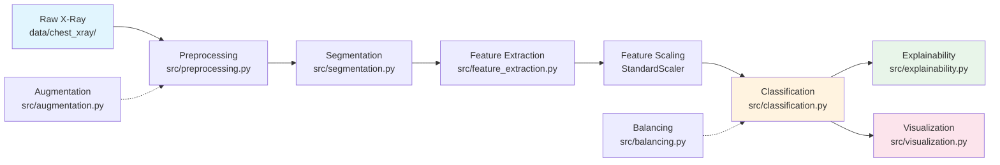

# Medical Image Analysis Learning Guide

## Chest X-Ray Pneumonia Detection Pipeline

Welcome to the Medical Image Analysis Assistant project. This guide walks you through every stage of our computer vision pipeline, from raw X-ray images to diagnostic predictions. Whether you are joining as a data engineer, ML specialist, or UI developer, this document will help you understand how the pieces fit together and why we made each design decision.

---

## Table of Contents

1. [Getting Started](#getting-started)
2. [Pipeline Overview](#pipeline-overview)
3. [Stage 1: Preprocessing](#stage-1-preprocessing)
4. [Stage 2: Segmentation](#stage-2-segmentation)
5. [Stage 3: Feature Extraction](#stage-3-feature-extraction)
6. [Stage 4: Classification](#stage-4-classification)
7. [Stage 5: Data Augmentation](#stage-5-data-augmentation)
8. [Stage 6: Class Balancing](#stage-6-class-balancing)
9. [Stage 7: Explainability](#stage-7-explainability)
10. [Stage 8: Visualization](#stage-8-visualization)
11. [Configuration System](#configuration-system)
12. [Running the Pipeline](#running-the-pipeline)
13. [Streamlit Application](#streamlit-application)
14. [Team Responsibilities](#team-responsibilities)

---

## Getting Started

### Prerequisites

- Python 3.10 or higher
- `uv` package manager (we do not use pip or Jupyter)
- Kaggle account for dataset access

### Quick Start

```bash
# 1. Clone the repository and enter the project directory
cd medical-cv

# 2. Install dependencies (already configured in pyproject.toml)
uv sync

# 3. Download the dataset
uv run python scripts/download_dataset.py

# 4. Train the models
uv run python src/pipeline.py

# 5. Launch the web app
uv run streamlit run app/app.py
```

### Project Structure

```
medical-cv/
├── src/
│   ├── config.py              # Centralized configuration
│   ├── preprocessing.py         # Stage 1: Image preprocessing
│   ├── segmentation.py          # Stage 2: Lung segmentation
│   ├── feature_extraction.py    # Stage 3: GLCM + shape features
│   ├── classification.py        # Stage 4: SVM/RF training
│   ├── pipeline.py              # End-to-end orchestration
│   ├── augmentation.py          # Stage 5: Medical-aware augmentation
│   ├── balancing.py             # Stage 6: Class balancing
│   ├── explainability.py        # Stage 7: Model interpretability
│   └── visualization.py         # Stage 8: Evaluation plots
├── app/
│   └── app.py                   # Streamlit web interface
├── scripts/
│   └── download_dataset.py      # Smart dataset downloader
├── config.yaml                  # All tunable parameters
├── data/chest_xray/             # Dataset (5,856 images)
└── models/                      # Saved models and plots
```

---

## Pipeline Overview

Our pipeline transforms raw chest X-ray images into pneumonia predictions using traditional computer vision and machine learning. We chose this approach over deep learning for three reasons:

1. **CPU efficiency**: Traditional ML runs on standard hardware without GPUs
2. **Interpretability**: Doctors can understand which texture and shape features drive predictions
3. **Low data requirements**: We achieve good results without thousands of labeled images

### Data Flow



### The 8-Dimensional Feature Vector

Every image becomes a vector of 8 numbers:

| Feature | Type | What It Captures |
|---------|------|------------------|
| Contrast | GLCM Texture | Local intensity variation |
| Correlation | GLCM Texture | Linear dependency of gray levels |
| Energy | GLCM Texture | Uniformity of texture |
| Homogeneity | GLCM Texture | Local gray level similarity |
| Area | Shape | Size of affected lung region |
| Perimeter | Shape | Boundary complexity |
| Eccentricity | Shape | Elongation of lesions |
| Solidity | Shape | Convexity (patchy infiltration) |

---

## Stage 1: Preprocessing

### Concept

Medical images arrive in different sizes, resolutions, and noise levels. Preprocessing standardizes them so downstream stages receive consistent input. In chest X-rays, we need to preserve anatomical structures while removing acquisition artifacts like sensor noise.

### Where

- **File**: `src/preprocessing.py`
- **Main function**: `preprocess_image(image_path, cfg)`
- **Dataset loader**: `load_dataset_paths(data_dir)`

### How

The `preprocess_image()` function performs 5 steps in order:

1. **Load as grayscale**: `cv2.imread(image_path, cv2.IMREAD_GRAYSCALE)`
   - Medical X-rays are inherently single-channel
   - Color information adds no diagnostic value

2. **Resize to 256x256**: `cv2.resize(img, pp.target_size)`
   - Standardizes input dimensions for the feature extractor
   - Configurable via `config.yaml`: `preprocessing.target_size`

3. **Gaussian blur**: `cv2.GaussianBlur(img, (5, 5), sigmaX=1.0)`
   - Smooths high-frequency noise while preserving edge structure
   - Kernel size and sigma are configurable

4. **Median filter**: `cv2.medianBlur(img, 5)`
   - Removes salt-and-pepper noise common in digital radiography
   - More effective than Gaussian for impulse noise

5. **Normalize to [0, 255]**: `cv2.normalize(..., cv2.NORM_MINMAX, dtype=cv2.CV_8U)`
   - Scales pixel values to full 8-bit range for optimal contrast
   - Ensures consistent intensity distributions across different scanners

The `load_dataset_paths()` function walks through `train/`, `val/`, and `test/` directories, collecting image paths and assigning labels (0 for NORMAL, 1 for PNEUMONIA).

### Why

- **Grayscale**: X-rays measure tissue density, not color. Keeping a single channel reduces computation.
- **256x256**: Large enough to preserve lung structure, small enough for fast feature extraction.
- **Gaussian + Median**: Gaussian handles Gaussian noise (electronic sensor noise); median handles impulse noise (dead pixels, artifacts). Using both gives cleaner images than either alone.
- **Normalization**: Different X-ray machines use different intensity ranges. Normalization makes the pipeline robust across equipment vendors.

### Configuration

```yaml
preprocessing:
  target_size: [256, 256]
  gaussian_kernel: [5, 5]
  gaussian_sigma: 1.0
  median_kernel: 5
```

---

## Stage 2: Segmentation

### Concept

Segmentation separates the lung region from background and other anatomical structures. In pneumonia detection, we care about texture and shape changes within the lung tissue, not the ribs or black background. Accurate segmentation ensures feature extraction focuses on diagnostically relevant regions.

### Where

- **File**: `src/segmentation.py`
- **Otsu thresholding**: `otsu_segmentation(image, cfg)`
- **K-means clustering**: `kmeans_segmentation(image, k, cfg)`

### How

#### Otsu Thresholding

`otsu_segmentation()` implements automatic binary thresholding:

1. **Compute optimal threshold**: `cv2.threshold(image, 0, 255, cv2.THRESH_BINARY + cv2.THRESH_OTSU)`
   - Otsu's method analyzes the image histogram and finds the threshold that minimizes intra-class variance
   - Ideal for medical images where tissue and background form bimodal distributions

2. **Create binary mask**: `(thresh > 0).astype(np.uint8) * 255`
   - Converts threshold output to a clean 0/255 mask

3. **Morphological opening**: `cv2.morphologyEx(mask, cv2.MORPH_OPEN, kernel, iterations=2)`
   - Removes small noise specks while preserving larger lung structures
   - Uses a 3x3 kernel with 2 iterations (configurable)

4. **Apply mask**: `cv2.bitwise_and(image, image, mask=mask)`
   - Returns both the binary mask and the masked image

#### K-Means Clustering

`kmeans_segmentation()` clusters pixels by intensity:

1. **Reshape to pixel list**: `image.reshape(-1, 1).astype(np.float32)`
   - Each pixel becomes a 1D feature vector (its intensity)

2. **Run K-means**: `cv2.kmeans(pixels, k=3, ..., cv2.KMEANS_RANDOM_CENTERS)`
   - Clusters into 3 groups: background, normal tissue, abnormal regions
   - Configurable iterations (10), epsilon (1.0), and attempts (10)

3. **Reconstruct image**: Replace each pixel with its cluster center value

4. **Normalize**: Scale back to 0-255 for visualization

### Why

- **Otsu**: Automatically adapts to different image brightness levels. No manual threshold tuning needed across different X-ray machines.
- **Morphological opening**: Medical images often have small artifacts (labels, edges). Opening cleans these without eroding actual lung boundaries.
- **K-means with k=3**: Three clusters naturally separate background (black), normal lung (gray), and dense/pathological regions (white). This gives clinicians an intuitive view of tissue separation.
- **Two methods**: Otsu provides a binary mask for feature extraction; K-means provides a richer multi-region view for visualization and debugging.

### Configuration

```yaml
segmentation:
  kmeans_k: 3
  morph_kernel_size: [3, 3]
  morph_iterations: 2
  kmeans_iterations: 10
  kmeans_epsilon: 1.0
  kmeans_attempts: 10
```

---

## Stage 3: Feature Extraction

### Concept

Feature extraction transforms images into numerical vectors that machine learning models can process. In medical imaging, we use domain-informed features: texture features capture the "graininess" of infected tissue, while shape features capture structural changes like consolidation and infiltrates.

### Where

- **File**: `src/feature_extraction.py`
- **Single image**: `extract_features(image, mask, cfg)`
- **Batch processing**: `build_feature_matrix(image_paths, labels, cfg)`

### How

`extract_features()` computes 8 features per image:

#### Texture Features (4) via GLCM

1. **Build GLCM**: `skimage.feature.graycomatrix(image, distances=[1], angles=[0], levels=256, symmetric=True, normed=True)`
   - Gray-Level Co-occurrence Matrix counts how often pixel pairs with specific gray levels occur at a given offset
   - Distance=1, angle=0 means we look at horizontally adjacent pixels
   - `symmetric=True` makes the matrix direction-invariant
   - `normed=True` converts counts to probabilities

2. **Extract properties**:
   - **Contrast**: `graycoprops(glcm, 'contrast')` - High when local intensity variation is strong. Pneumonia creates patchy, high-contrast regions.
   - **Correlation**: `graycoprops(glcm, 'correlation')` - Measures linear dependency. Healthy tissue has more regular structure.
   - **Energy**: `graycoprops(glcm, 'energy')` - Sum of squared GLCM elements. Uniform textures have high energy.
   - **Homogeneity**: `graycoprops(glcm, 'homogeneity')` - Inverse difference moment. Measures local gray level similarity.

#### Shape Features (4) via Region Properties

1. **Label connected components**: `skimage.measure.label(mask_binary)`
2. **Extract regions**: `skimage.measure.regionprops(labels)`
3. **Select largest region**: `max(regions, key=lambda r: r.area)`
   - The lung is typically the largest connected region after Otsu segmentation

4. **Compute shape metrics**:
   - **Area**: `largest_region.area / image_size` - Normalized by total image size. Pneumonia often increases affected area.
   - **Perimeter**: `largest_region.perimeter` - Boundary length. Diseased regions have irregular, complex boundaries.
   - **Eccentricity**: `largest_region.eccentricity` - How elongated the shape is. Pneumonia patterns tend to be irregular.
   - **Solidity**: `largest_region.solidity` - Area / convex hull area. Patchy infiltration reduces solidity.

`build_feature_matrix()` loops through all images, calling `preprocess_image()` → `otsu_segmentation()` → `extract_features()`, printing progress every 100 images.

### Why

- **GLCM texture**: Pneumonia changes the microscopic texture of lung tissue. GLCM captures these changes better than raw pixel values because it models spatial relationships.
- **4 texture features**: Contrast and homogeneity capture local variation; correlation captures structure regularity; energy captures uniformity. Together they describe the "feel" of the tissue.
- **Shape features from segmentation**: Pneumonia causes consolidation (increased area), infiltrates (irregular perimeter), and patchy patterns (reduced solidity). These are clinically recognized markers.
- **Largest region**: After Otsu segmentation, the lung is usually the largest connected component. Using only this region excludes ribs, labels, and background from shape analysis.

### Configuration

```yaml
feature_extraction:
  glcm_distances: [1]
  glcm_angles: [0]
  glcm_levels: 256
```

---

## Stage 4: Classification

### Concept

Classification learns to distinguish NORMAL from PNEUMONIA using the 8 extracted features. We train two models (SVM and Random Forest) to compare approaches and provide ensemble confidence.

### Where

- **File**: `src/classification.py`
- **Training**: `train_and_evaluate(X_train, y_train, X_test, y_test, cfg)`
- **Save models**: `save_models(results, models_dir)`
- **Load models**: `load_best_model(models_dir)`
- **Single prediction**: `predict_single(image_path, scaler, model, cfg)`

### How

#### Training Pipeline

1. **Feature scaling**: `StandardScaler()`
   - `scaler.fit_transform(X_train)` and `scaler.transform(X_test)`
   - Features have different scales (e.g., contrast vs. normalized area)
   - SVM convergence improves with normalized features

2. **Train SVM**: `SVC(kernel='rbf', C=10.0, gamma='scale', probability=True, random_state=42)`
   - RBF kernel handles non-linear decision boundaries common in medical data
   - `probability=True` enables confidence scores
   - C=10.0 provides moderate regularization

3. **Train Random Forest**: `RandomForestClassifier(n_estimators=200, random_state=42)`
   - 200 trees provide stable predictions without overfitting
   - Ensemble method is robust to noisy medical labels

4. **Evaluate both models**:
   - Accuracy, precision, recall, F1-score
   - Confusion matrix for error pattern analysis

#### Prediction Pipeline

`predict_single()` runs the full inference chain:

1. `preprocess_image(image_path, cfg)` - Load and clean the image
2. `otsu_segmentation(img, cfg)` - Create lung mask
3. `extract_features(img, mask, cfg)` - Get 8 feature values
4. `scaler.transform([features])` - Scale to training distribution
5. `model.predict()` and `model.predict_proba()` - Get class and confidence

Returns: `{'prediction': 'NORMAL'|'PNEUMONIA', 'confidence': 0.0-1.0, 'features': np.ndarray}`

### Why

- **Two models**: SVM excels with high-dimensional, clear-margin data; Random Forest handles feature interactions and provides built-in importance scores. Comparing them reveals whether findings are model-specific or robust.
- **RBF kernel**: Medical decision boundaries are rarely linear. RBF maps features into a higher-dimensional space where separation is easier.
- **StandardScaler**: SVM is sensitive to feature scales. Without scaling, area (0-1) would be dominated by perimeter (hundreds of pixels).
- **probability=True**: Clinicians need confidence scores, not just binary labels. A "PNEUMONIA" prediction with 51% confidence requires different action than one with 95% confidence.
- **joblib serialization**: Models are saved as `.pkl` files and committed to Git. New teammates can run the Streamlit app immediately without retraining.

### Configuration

```yaml
classification:
  svm_kernel: "rbf"
  svm_c: 10.0
  svm_gamma: "scale"
  svm_random_state: 42
  rf_n_estimators: 200
  rf_random_state: 42
```

---

## Stage 5: Data Augmentation

### Concept

Medical datasets are often small and expensive to acquire. Augmentation artificially expands training data by applying transformations that preserve diagnostic validity. In chest X-rays, we must respect anatomical constraints: lungs have a fixed orientation, and extreme rotations would make the image clinically uninterpretable.

### Where

- **File**: `src/augmentation.py`
- **Single image**: `augment_image(image, config, cfg)`
- **Batch augmentation**: `augment_batch(images, labels, config, multiplier, cfg)`
- **Dataset generation**: `generate_augmented_dataset(input_dir, output_dir, multiplier)`

### How

`augment_image()` applies enabled transforms in a specific order:

1. **Geometric transforms** (first, because they move pixels):
   - **Rotation**: `cv2.getRotationMatrix2D(center, angle, 1.0)` with random angle in [-15, 15] degrees
   - **Zoom**: Center crop with factor in [0.9, 1.1], then resize back
   - **Shear**: Affine transformation with angle in [-5, 5] degrees
   - **Translation**: Random offset up to 10% of image dimensions
   - **Horizontal flip**: `cv2.flip(image, 1)` with 50% probability

2. **Intensity transforms** (after geometric, to avoid interpolation artifacts):
   - **Brightness**: Multiply by factor in [0.8, 1.2]
   - **Contrast**: Shift from mean, scale by factor in [0.8, 1.2]
   - **Noise**: Add Gaussian noise with std in [0.01, 0.05] * 255

All transforms use `BORDER_REFLECT` padding to avoid black borders that would confuse the segmentation stage.

`augment_batch()` generates `multiplier` augmented copies per image, preserving labels.

`generate_augmented_dataset()` walks input directories, saves originals, and writes augmented copies with `_aug{N}` suffixes.

### Why

- **Medical-aware constraints**: No vertical flips (would place heart on wrong side), limited rotation (extreme angles make lungs unrecognizable), small shear and translation (preserves anatomical relationships).
- **Horizontal flip**: Chest X-rays exhibit bilateral symmetry. Flipping preserves clinical validity and doubles effective data.
- **Order matters**: Geometric transforms first prevents blurring from multiple interpolations. Intensity changes last avoids amplifying noise during resizing.
- **BORDER_REFLECT**: Black borders from constant padding would be misinterpreted as pathology by Otsu thresholding. Reflection padding blends naturally.

### Configuration

```yaml
augmentation:
  max_rotation_angle: 15.0
  brightness_range: [0.8, 1.2]
  contrast_range: [0.8, 1.2]
  noise_std_range: [0.01, 0.05]
  zoom_range: [0.9, 1.1]
  shear_range: [-5.0, 5.0]
  translation_range: [0.1, 0.1]
  horizontal_flip_prob: 0.5
  vertical_flip_prob: 0.0
```

---

## Stage 6: Class Balancing

### Concept

Medical datasets often have imbalanced classes. If pneumonia cases are rarer than normal cases, models learn to predict "normal" most of the time, achieving high accuracy while missing actual pathology. Balancing ensures the model pays equal attention to both classes.

### Where

- **File**: `src/balancing.py`
- **Main function**: `balance_dataset(X, y, strategy, cfg)`
- **Oversampling**: `oversample_minority(X, y, cfg)`
- **Undersampling**: `undersample_majority(X, y, random_state)`
- **SMOTE**: `_apply_smote(X, y)`

### How

`balance_dataset()` dispatches to three strategies:

#### Oversampling (default)

1. Identify minority and majority classes by counting labels
2. For each minority class, compute how many samples are needed to match the majority count
3. Randomly select existing minority samples with replacement
4. Add Gaussian noise (`std=0.01`) to duplicated features
5. Concatenate original and synthetic samples

#### Undersampling

1. Identify minority count
2. For each majority class, randomly sample down to minority count using `sklearn.utils.resample`
3. Concatenate all classes at the reduced size

#### SMOTE (Synthetic Minority Over-sampling Technique)

1. Identify minority class and count
2. For each needed synthetic sample:
   - Pick two random minority samples
   - Generate a random interpolation factor `alpha` in [0, 1]
   - Create synthetic sample: `sample_a + alpha * (sample_b - sample_a)`
3. Concatenate originals and synthetics

All strategies print class distribution before and after balancing.

### Why

- **Oversampling with noise**: Simple duplication causes overfitting (the model memorizes exact copies). Adding slight noise forces the model to learn the underlying distribution, not individual samples.
- **Undersampling**: Fast and effective when you have abundant majority data. The trade-off is losing potentially useful normal cases.
- **SMOTE**: Creates more diverse synthetic samples than noise-added duplicates by interpolating between real minority cases. This works well when minority samples form clusters in feature space.
- **Default is oversample**: It preserves all original data while avoiding exact duplication. In medical contexts, we rarely want to discard real patient data.

### Configuration

```yaml
balancing:
  strategy: "oversample"
  apply_balancing: true
  oversample_noise_std: 0.01
```

---

## Stage 7: Explainability

### Concept

Doctors cannot trust black-box predictions. Explainability reveals which features drove each prediction, enabling clinical validation. If the model relies on medically irrelevant artifacts (like image borders), clinicians can catch this before deployment.

### Where

- **File**: `src/explainability.py`
- **Single prediction**: `explain_prediction(model, scaler, features, feature_names)`
- **Global importance**: `compute_permutation_importance(model, X, y, feature_names, cfg)`
- **Report generation**: `generate_prediction_report(explanation, cfg)`

### How

#### Perturbation-Based Explanation

`explain_prediction()` measures per-feature contribution:

1. Scale the feature vector using the trained scaler
2. Get baseline prediction and probability for the predicted class
3. For each of the 8 features:
   - Create a perturbed copy where that feature is replaced with its mean (0 after scaling)
   - Re-run prediction
   - Contribution = absolute drop in predicted-class probability
4. Rank features by contribution magnitude
5. Return top 3 most influential features

#### Permutation Importance

`compute_permutation_importance()` measures global feature importance:

1. Compute baseline accuracy on the test set
2. For each feature:
   - Shuffle its values across all test samples (breaking feature-target relationship)
   - Compute new accuracy
   - Importance = baseline accuracy - shuffled accuracy
3. Repeat 10 times (configurable) and average for stability

#### Human-Readable Report

`generate_prediction_report()` formats the explanation:

- Shows prediction and confidence percentage
- Lists top 3 features with scores
- Classifies influence as "high" (>=0.3), "moderate" (>=0.1), or "low"

### Why

- **Perturbation, not Grad-CAM**: Our models are traditional ML (SVM/RF), not neural networks. Grad-CAM requires gradients, which these models do not expose. Perturbation is model-agnostic and works for any sklearn classifier.
- **Replace with mean**: Setting a feature to its mean approximates "what if this feature had no diagnostic value?" The larger the probability drop, the more the model relied on that feature.
- **Permutation importance**: Unlike Random Forest's built-in `feature_importances_`, permutation importance is model-agnostic. Computing it for both SVM and RF reveals whether both models rely on the same features, strengthening clinical confidence.
- **Influence thresholds**: Raw numbers are hard for clinicians to interpret. "High influence" labels make the output actionable without statistical expertise.

### Configuration

```yaml
explainability:
  permutation_n_repeats: 10
  high_influence_threshold: 0.3
  moderate_influence_threshold: 0.1
```

---

## Stage 8: Visualization

### Concept

Visualizations translate model performance into intuitive graphics. In medical ML, they serve two audiences: engineers (who need precise metrics) and clinicians (who need interpretable safety evidence). Our plots are designed for both.

### Where

- **File**: `src/visualization.py`
- **ROC curve**: `plot_roc_curve(y_true, y_scores, save_path, title, cfg)`
- **Precision-Recall curve**: `plot_precision_recall_curve(y_true, y_scores, save_path, title, cfg)`
- **Confusion matrix**: `plot_confusion_matrix_detailed(y_true, y_pred, class_names, save_path, title, cfg)`
- **Model comparison**: `plot_model_comparison(metrics, save_path, cfg)`
- **Feature distributions**: `plot_feature_distribution(X, y, feature_names, save_path, cfg)`
- **Feature importance**: `plot_feature_importance_bar(importance, save_path, title, cfg)`

### How

#### ROC Curve

- Computes false positive rate and true positive rate across thresholds using `sklearn.metrics.roc_curve`
- Calculates AUC (Area Under Curve)
- Plots curve with diagonal reference line for random classifier
- Saved to `models/roc_curve.png`

#### Precision-Recall Curve

- Computes precision and recall across thresholds using `sklearn.metrics.precision_recall_curve`
- Calculates average precision score
- More informative than ROC for imbalanced medical datasets
- Saved to `models/pr_curve.png`

#### Confusion Matrix

- Computes confusion matrix using `sklearn.metrics.confusion_matrix`
- Annotates each cell with count and percentage of total
- Uses white text on dark cells, black on light cells for readability
- Saved to `models/confusion_matrix_detailed.png`

#### Model Comparison

- Creates grouped bar chart comparing SVM and RF across accuracy, precision, recall, and F1
- Uses distinct colors (#3498db for SVM, #e74c3c for RF)
- Saved to `models/model_comparison.png`

#### Feature Distributions

- Creates 2-column grid of histograms (one per feature)
- Overlays NORMAL (green, #2ecc71) and PNEUMONIA (red, #e74c3c) distributions
- Reveals which features separate the classes
- Saved to `models/feature_distribution.png`

#### Feature Importance Bar Chart

- Horizontal bar chart sorted by importance (highest at top)
- Adds numeric labels at bar ends
- Saved to `models/feature_importance_bar.png`

### Why

- **ROC for threshold selection**: Clinicians can choose operating points. A screening tool needs high sensitivity (top-left of ROC); a confirmatory test needs high specificity (bottom-left).
- **PR for imbalanced data**: When pneumonia is rare, ROC can look deceptively good. PR curves show the true precision-recall trade-off.
- **Confusion matrix with percentages**: Raw counts alone are misleading with different test set sizes. Percentages make error rates comparable across experiments.
- **Feature distributions**: If NORMAL and PNEUMONIA histograms overlap completely for a feature, that feature is unreliable. Well-separated distributions validate our feature engineering.
- **Consistent styling**: All plots use the same color scheme, DPI (150), and figure sizes. This creates a professional, publication-ready report.

### Configuration

```yaml
visualization:
  figure_dpi: 150
  figure_size_standard: [10, 6]
  figure_size_wide: [14, 6]
  figure_size_square: [8, 8]
  figure_size_confusion: [10, 4]
  figure_size_importance: [8, 5]
  cmap_heatmap: "Blues"
  cmap_confusion: "viridis"
  color_normal: "#2ecc71"
  color_pneumonia: "#e74c3c"
  bar_color: "#3498db"
```

---

## Configuration System

### Architecture

All pipeline behavior is controlled through a two-layer configuration system:

1. **Python dataclasses** (`src/config.py`): Define defaults, types, and documentation
2. **YAML file** (`config.yaml`): Override any default without touching code

### How It Works

`src/config.py` defines nested dataclasses:

```python
@dataclass
class PreprocessingConfig:
    target_size: tuple[int, int] = (256, 256)
    gaussian_kernel: tuple[int, int] = (5, 5)
    gaussian_sigma: float = 1.0
    median_kernel: int = 5

@dataclass
class PipelineConfig:
    preprocessing: PreprocessingConfig = field(default_factory=PreprocessingConfig)
    segmentation: SegmentationConfig = field(default_factory=SegmentationConfig)
    # ... etc
```

`load_config()` merges defaults with YAML overrides:

1. Convert default dataclass to nested dictionary
2. Load `config.yaml` if it exists
3. Recursively merge YAML values into defaults
4. Convert merged dictionary back to dataclass

`get_config()` provides a module-level singleton so all modules share the same configuration.

### Why

- **Centralized tuning**: Medical teams can adjust parameters for different datasets, hardware constraints, or clinical requirements without reading Python code.
- **Type safety**: Dataclasses enforce types. A typo in `config.yaml` will fail early with a clear error.
- **Deep merge**: You only override what you need. If you want to change just `svm_c`, you do not have to copy the entire classification section.
- **Singleton pattern**: All modules call `get_config()` and receive the same object. There is no risk of inconsistent parameters between preprocessing and classification.

### Usage

```python
from src.config import get_config

cfg = get_config()
print(cfg.preprocessing.target_size)      # (256, 256)
print(cfg.classification.svm_c)           # 10.0
print(cfg.balancing.strategy)             # "oversample"
```

---

## Running the Pipeline

### Full Training

```bash
uv run python src/pipeline.py
```

This executes the complete workflow:

1. Load dataset paths from `data/chest_xray/`
2. Separate train and test splits by path inspection
3. Build feature matrices for train and test
4. Train SVM and Random Forest
5. Print comparison table
6. Save models to `models/`
7. Save confusion matrix and feature importance plots
8. Apply class balancing (if enabled) and retrain
9. Generate ROC, PR, detailed confusion matrix, model comparison, feature distribution, and feature importance bar charts
10. Compute permutation importance for both models

### Individual Components

You can run any stage independently for testing:

```python
# Preprocess a single image
from src.preprocessing import preprocess_image
img = preprocess_image("data/chest_xray/test/PNEUMONIA/person1_bacteria_1.jpeg")

# Segment it
from src.segmentation import otsu_segmentation
mask, segmented = otsu_segmentation(img)

# Extract features
from src.feature_extraction import extract_features
features = extract_features(img, mask)
print(features)  # 8-element numpy array

# Predict
from src.classification import load_best_model, predict_single
scaler, svm, rf = load_best_model("models")
result = predict_single("path/to/image.jpeg", scaler, svm)
print(result['prediction'], result['confidence'])
```

### Dataset Download

```bash
uv run python scripts/download_dataset.py
```

This script:
- Checks if `data/chest_xray/` already exists with correct structure
- If not, downloads from Kaggle using the Kaggle API
- Verifies extracted structure (train/val/test with NORMAL/PNEUMONIA)
- Prints dataset summary with image counts

---

## Streamlit Application

### Launch

```bash
uv run streamlit run app/app.py
```

The app runs on `http://localhost:8501` by default.

### Structure

`app/app.py` provides two tabs:

#### Tab 1: Analysis

- **File uploader**: Accepts jpg, jpeg, png
- **Visual pipeline**: Shows original, preprocessed, Otsu mask, and K-means segmentation side-by-side
- **Prediction badge**: Green "NORMAL" or red "PNEUMONIA"
- **Confidence score**: Percentage display
- **Feature table**: All 8 features with values
- **Feature bar chart**: Visual comparison of feature magnitudes
- **Explainability panel** (toggleable): Shows top 3 contributing features with influence levels and a contribution bar chart
- **Augmentation preview** (toggleable): Shows 4 augmented versions (rotation, brightness+contrast, noise, zoom+flip)

#### Tab 2: Model Report

- **Performance metrics**: Accuracy, precision, recall, F1 for both SVM and Random Forest
- **Dataset statistics**: Test sample count, NORMAL count, PNEUMONIA count, feature count
- **Visualization gallery**: Displays all generated plots from `models/`
- **Feature importance table**: Sorted Random Forest importances with 4 decimal precision

### Key Implementation Details

- **Model caching**: `@st.cache_resource` loads models once and keeps them in memory across user interactions
- **Metrics caching**: `@st.cache_data` computes test set metrics only when config changes
- **Temporary files**: Uploaded images are written to `tempfile.NamedTemporaryFile` because OpenCV requires file paths, not byte streams
- **Path resolution**: `sys.path.insert(0, str(_project_root))` ensures `src.*` imports work when Streamlit runs from the `app/` directory

---

## Team Responsibilities

This project is built by 8 team members. Each owns specific modules:

| Member | Role | Primary Files |
|--------|------|---------------|
| 1 | Data Pipeline Lead | `src/preprocessing.py`, `scripts/download_dataset.py` |
| 2 | Segmentation Specialist | `src/segmentation.py` |
| 3 | Feature Engineering Lead | `src/feature_extraction.py` |
| 4 | ML Model Engineer | `src/classification.py` |
| 5 | Pipeline Orchestrator | `src/pipeline.py` |
| 6 | Frontend/UI Developer | `app/app.py` |
| 7 | Visualization & Explainability Lead | `src/explainability.py`, `src/visualization.py` |
| 8 | Data Augmentation & Enhancement Specialist | `src/augmentation.py`, `src/balancing.py` |

### Dependency Chain

```
Member 1 (Preprocessing)
    |
    v
Member 2 (Segmentation) -----> Member 3 (Feature Extraction)
    |                              |
    |                              v
    |                         Member 4 (Classification)
    |                              |
    |                              v
    |                         Member 5 (Pipeline)
    |                              |
    |                              v
    +------------------------> Member 6 (Frontend)

Member 8 (Augmentation) -----> Member 1 (feeds into preprocessing)
    |
    v
Member 4 (Classification) ---> Member 7 (Explainability)
```

When modifying code, check which downstream members depend on your module. Changing feature names in `feature_extraction.py`, for example, requires updates in `classification.py`, `explainability.py`, `visualization.py`, and `app/app.py`.

---

## Key Design Decisions Summary

| Decision | Rationale |
|----------|-----------|
| Traditional ML, not deep learning | CPU efficiency, interpretability, low data requirements |
| 8 hand-crafted features | Clinically interpretable; doctors can validate each feature |
| SVM + Random Forest ensemble | Compares linear vs. tree-based approaches; RF provides built-in importance |
| Otsu + K-means segmentation | Otsu for robust binary masks; K-means for richer tissue visualization |
| GLCM texture features | Capture pneumonia's characteristic "grainy" patterns |
| StandardScaler before classification | SVM convergence; fair comparison of features with different units |
| Configurable via YAML | Medical teams can tune without reading Python |
| Models committed to Git | New teammates run the app immediately without retraining |
| Perturbation-based explainability | Works for traditional ML where Grad-CAM is not applicable |
| No vertical flips in augmentation | Anatomically invalid for chest X-rays |

---

## Glossary

- **GLCM**: Gray-Level Co-occurrence Matrix. A statistical method for examining texture by counting pixel pairs at specific offsets.
- **Otsu thresholding**: Automatic histogram-based threshold selection that minimizes intra-class variance.
- **Morphological opening**: Erosion followed by dilation. Removes small noise while preserving larger structures.
- **RBF kernel**: Radial Basis Function kernel for SVM. Maps data to infinite-dimensional space for non-linear separation.
- **SMOTE**: Synthetic Minority Over-sampling Technique. Generates synthetic samples by interpolating between real minority cases.
- **Permutation importance**: Model-agnostic feature importance measured by shuffling feature values and observing accuracy drop.
- **Solidity**: Ratio of region area to convex hull area. Measures convexity; patchy infiltration reduces solidity.
- **Eccentricity**: Ratio of focal distance to major axis length. Measures shape elongation.

---

*This guide references actual code from the medical-cv repository. For the latest implementation details, always check the source files directly.*
